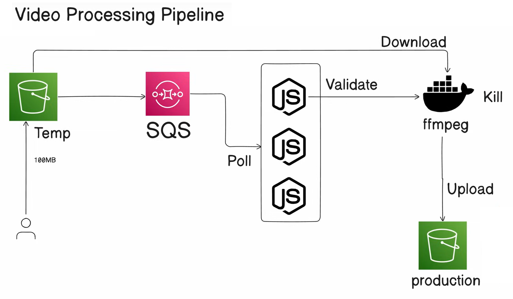

# VidStreamX
VidStreamX is a scalable video transcoding pipeline inspired by MUX, designed for efficient video processing and distribution. Built with AWS services like S3 and SQS, it enables seamless video uploads, transcoding, and optimized delivery. The system is designed with scalability, error handling, and efficient resource utilization in mind.

## Architecture Overview

The VidStreamX pipeline consists of two main components:



1. **Consumer**:
   - Listens to an AWS SQS queue for events triggered by S3 bucket uploads.
   - Processes incoming messages to extract details about uploaded video files.
   - Deletes processed messages from the queue after successful handling.

2. **Transcoder**:
   - A containerized service built with Go and FFmpeg.
   - Responsible for transcoding video files into desired formats.
   - Uses FFmpeg for efficient video processing.

### Workflow

1. A video file is uploaded to an S3 bucket.
2. An event notification is triggered, sending a message to the SQS queue.
3. The **Consumer** service:
   - Polls the SQS queue for new messages.
   - Extracts the S3 bucket and object details from the message.
   - Passes the video file details to the **Transcoder** service for processing.
4. The **Transcoder** service:
   - Downloads the video file from the S3 bucket.
   - Transcodes the video into the required formats using FFmpeg.
   - Uploads the transcoded files back to the S3 bucket.

### Prerequisites

1. Create an S3 bucket to store uploaded videos.
2. Create an SQS queue.
3. Update the access policy in the SQS queue:
    ```json
    "Statement": [
      // existing values
      {
        "Sid": "allowS3BucketToSendMessage",
        "Effect": "Allow",
        "Principal": {
          "Service": "s3.amazonaws.com"
        },
        "Action": "SQS:SendMessage",
        "Resource": "arn link of sqs",
        "Condition": {
          "ArnLike": {
            "aws:SourceArn": "s3 bucket arn"
          }
        }
      }
    ]
    ```
4. Configure an event notification in the S3 bucket to send messages to the SQS queue for `.mp4` file uploads.
5. Build the image for transcoder, upload it to ECR (export all env & use push commands displayed)
6. Make a ecs cluster (fargate). Create a task defination & provide uri of your image.

### Components

- **Consumer**:
  - Located in `/workspaces/VidStreamX/consumer`.
  - Handles SQS message processing and interacts with the S3 bucket.

- **Transcoder**:
  - Located in `/workspaces/VidStreamX/transcoder`.
  - A Dockerized service that uses FFmpeg for video transcoding.

### Deployment

- Use the provided `Dockerfile` in the `transcoder` directory to build and deploy the transcoder service.
- Ensure the `.env` file in the `consumer` directory is configured with valid AWS credentials and region information.