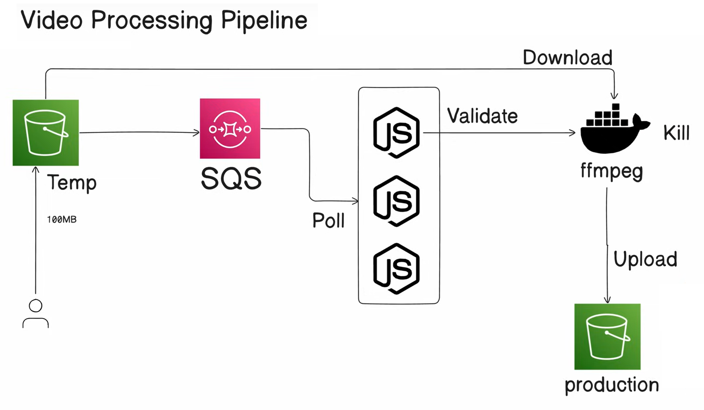

# VidStreamX
TranscodeFlow is a scalable video transcoding pipeline inspired by MUX, designed for efficient video processing and distribution. Built with AWS services like S3 and SQS, it enables seamless video uploads, transcoding, and optimized delivery. The system is designed with scalability, error handling, and efficient resource utilization in mind.

Prerequistes:

1. make a s3 bucket (to store first upload vids)
2. make a sqs
3. update the access policy in sqs
    add this object inside "Statement"
    "Statement": [
   // existing values
    {
      "Sid": "allowS3BucketToSendMessage",
      "Effect": "Allow",
      "Principal": {
        "Service": "s3.amazonaws.com"
      },
      "Action": "SQS:SendMessage",
      "Resource": "arn link of sqs",
      "Condition": {
        "ArnLike": {
          "aws:SourceArn":"s3 bucket arn"
        }
      }
    }
  ]
4. go to bucket & create a event notification
   add suffix .mp4